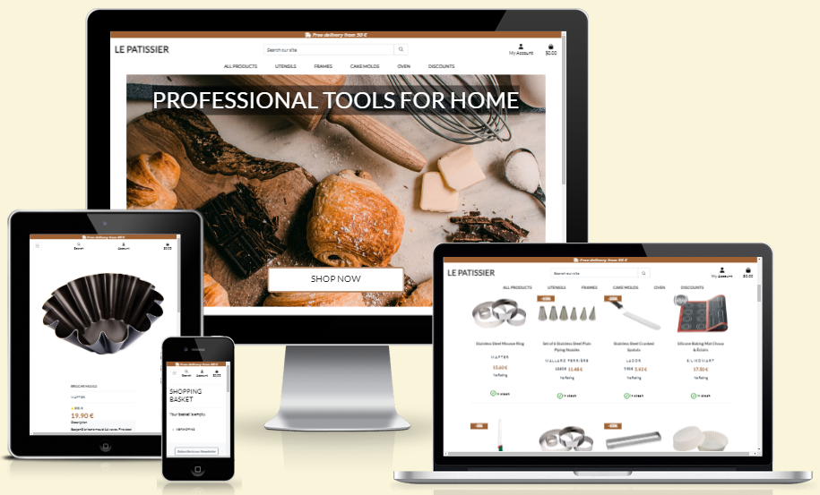
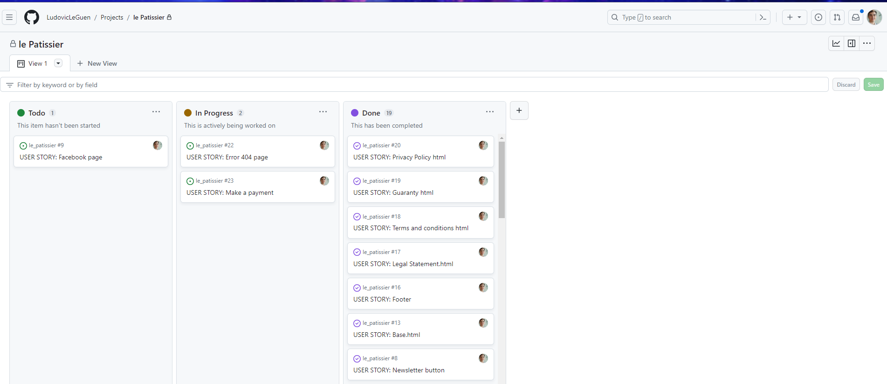
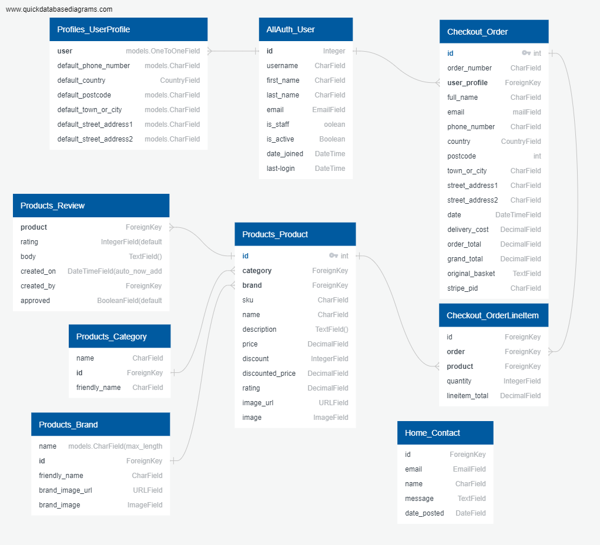
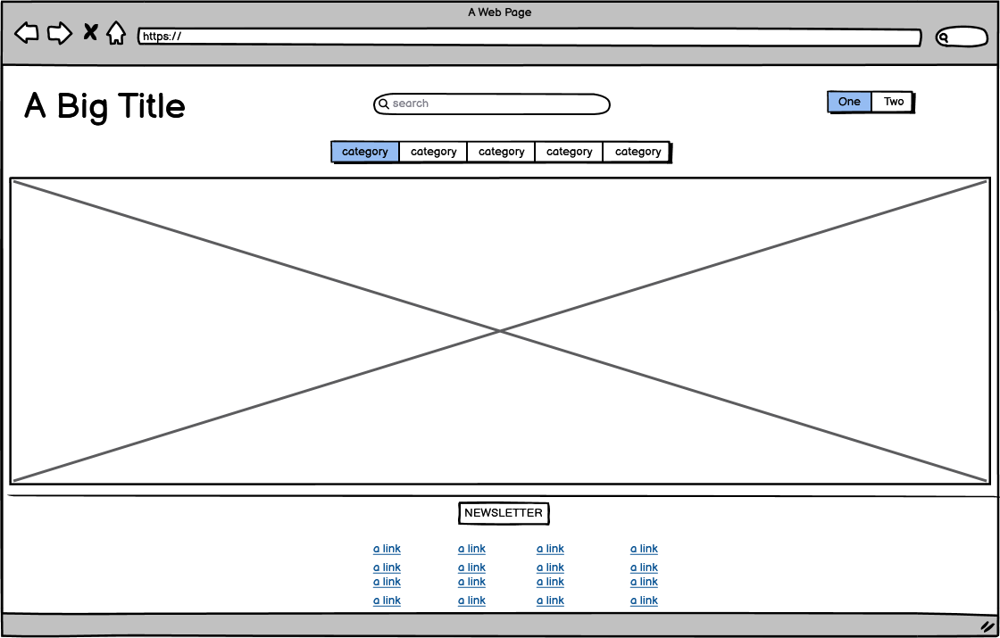
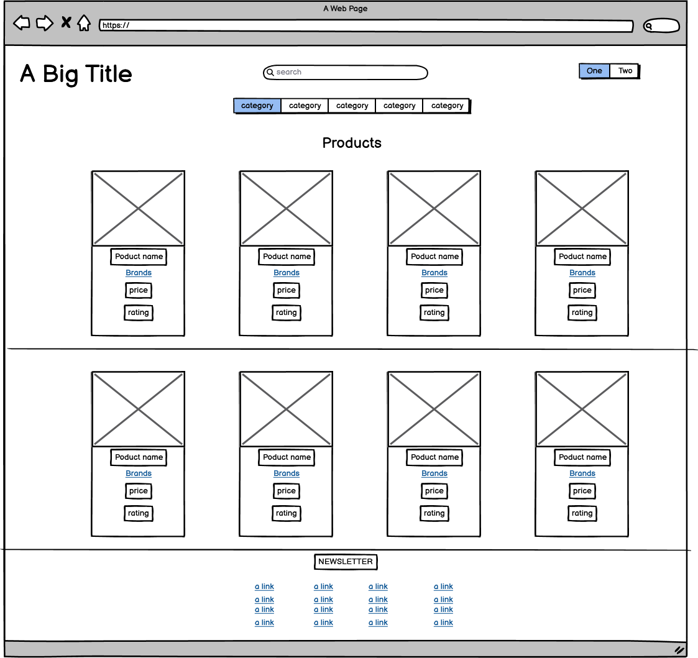
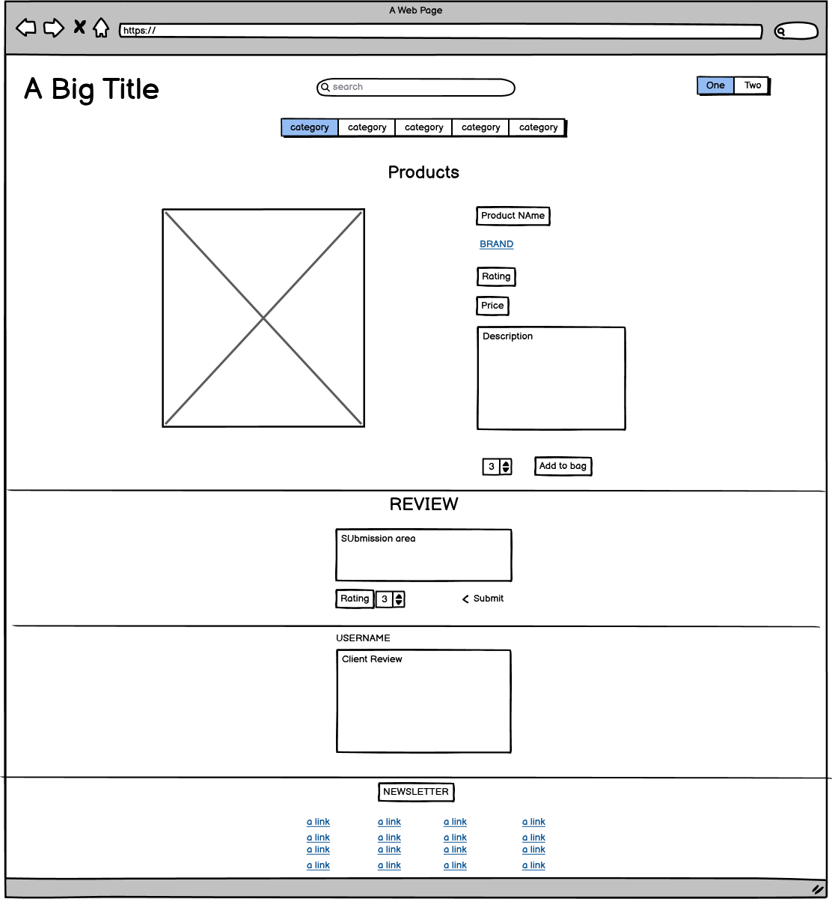
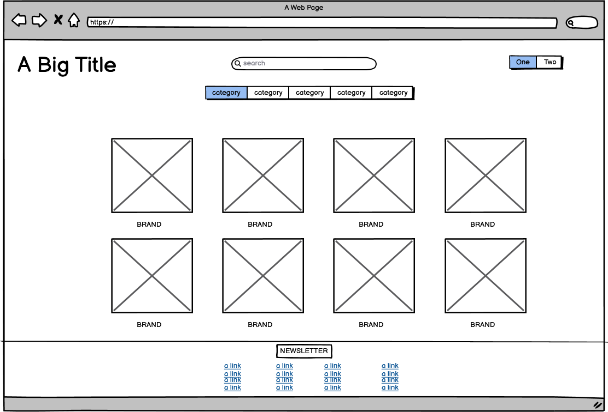
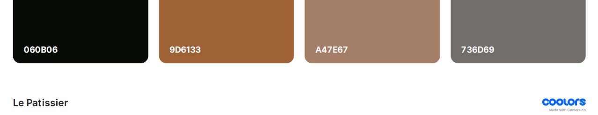

# le-patissier

Welcome to le Patissier. This website constitutes the 5th and last portfolio project of Code Institute in order to be graduated from their Academy. This project uses Django, Javascript (jQuery), Python, CSS3, Bootstap and obviously HTML5 in order to build this eCommerce application. 
This website is a B2C platform allowing users to purchase professional pastry tools.  
Le patissier is built on products lists, browsable categories, product details, shopping basket and payments.  
On top of it, the site owners inntend to create a strong marketing campaign based on Facebook and Youtube.  

[Click here to access live project](https://le-patissier-b2d63743796c.herokuapp.com/)
## Table of contents
1. [Introduction](#Introduction)
2. [UX](#UX)
    1. [Ideal User Demographic](#Ideal-User-Demographic)
    2. [User Stories](#User-Stories)
    3. [Development Planes](#Development-Planes)
    4. [Design](#Design)
3. [Features](#Features)
    1. [Design Features](#Design-Features) 
    2. [Existing Features](#Existing-Features)
    3. [Features to Implement in the future](#Features-to-Implement-in-the-future)
4. [Issues and Bugs](#Issues-and-Bugs)
5. [Technologies Used](#Technologies-Used)
     1. [Main Languages Used](#Main-Languages-Used)
     3. [Frameworks, Libraries & Programs Used](#Frameworks,-Libraries-&-Programs-Used)
6. [Testing](#Testing)
     1. [Testing.md](TESTING.md)
7. [Deployment](#Deployment)
     1. [Deploying on GitHub Pages](#Deploying-on-GitHub-Pages)
8. [Credits](#Credits)
     1. [Media](#Media)
     2. [Code](#Code)
9. [Acknowledgements](#Acknowledgements)
***

## Introduction
Le Patissier is the 5th and last project for Code Institute's full stack development degree.
The minimum requirements of this project are:
* Building an E-commerce platform
* Use of Search Engine Optimization on the website
* Insert Web Marketing strategies
* Insert a robot.txt file
* Insert a sitemap.xml
* Descriptive metatags
* Creating a Facebook page
* Incorporating a newsletter
* Providing a business model
* Have at least 3 original models
* Implement a custom 404 page
* Show and use an agile methodlogy throughout the project

[Back to top ⇧](#le-patissier)

## UX
### Ideal User Demographic
The users targeted have to enjoy baking and most of all have to be serious about it.
The website is built for 3 types of users:
* First time user who want to see what products we have and at what price
* Recurrent Buyers
* The site admins

### User-Stories
#### Recurrent Buyer Goals
* Log in and see their profile
* Find their favorites products
* Browse the catalog and find the correct products
* Save their info to speed payments process

#### New User Goals
* New Users need to understand the site easily
* New Users need to browse content quickly
* New Users want to experience the site 
* new Users want to feel secure to make a first purchase

#### Site Administrators
* The admnins need to control all aspects of the site
* The admins need to moderate comments
* The admin need to create edit and delete products, categories, and brands
* The admin need to navigate between the site and admin easily.

#### Development Methodology
* The development followed an Agile methodology on the [le Patissier github Project](https://github.com/users/LudovicLeGuen/projects/6 "Link to Le Patissier github Project")

Agile board

 

* All project database was base on the following Database Shema.

Database Schema

[Back to top ⇧](#le-patissier)

### Development-Planes

The website has to answer the aforementioned needs of all users types and therefore must contain a variety of CRUD functionality for the products and a user profile management system. Furthermore, a simple yet intuitive payment system must be implemented. Users might also want to subscribe to see the new products. Finally, a review section is imperative.

#### Strategy
The website will focus on the following target audience
* Audience
    * New Users
    * Frequent users
    * Pastry enthusiasts
    * Curious people 
    
* Demographic
    * Adults 
    * Young adults
    * Independant adults
    * Professional chefs
    * Artistic and creative people
    
* Psycho Characteristics
    * Epicurian
    * Curious

* The Users must find this information:
    * The name of the categories
    * The name of the products
    * The price of the products
    * The Brand
    * The picture of the product
    * The review of the product
    * All product by categories for comparaison
    * A shopping basket
    * Total to pay
    * The possibility to Log in Log out or register
    * The possibility to post reviews
    * The possibility to subscribe to a newsletter
    * Clear validation of their actions
    * The legal statements of the company

    
* The Administrator has to receive these information:
    * The profile of the users
    * The products
    * the Brands
    * The Categories
    * The review
    * the possibility to delete and manage all of the above

[Back to top ⇧](#le-patissier)

#### Scope

Now that we have established the goals of the website we can deduce the necessary features and content:
* Required Content
    * A quick description of the purpose of the site
    * A full product information card 
    * Users profile
    * Legal neceesities
    * Payment information

* Required functionality
    * A form to register
    * A form to login with the same credentials
    * A form to log out
    * An automatic profile creation
    * A form to update a profile
    * A page to show a profile
    * a page to show all profiles
    * A form to create a recipe
    * A form to update a recipe
    * A form to delete a recipe
    * A Page to display all recipes
    * A method to collect a recipe
    * A method to discard a recipe
    * A method to comment a recipe
    * An administration to manage the site

[Back to top ⇧](#le-patissier)

#### Structure

The website will consist of 12 pages. 

   1. **A Home page** with the purpose of the site for first users and the recipe content or the logged in users.     
   2. **An all products page** with all products
   3. **A product detail page** to register on the site.
   4. **A Log in page** to log in with your credentials.
   5. **A log out page** to confirm if users want to leave.
   6. **A profile page** to show your Bio and your recipe too.This will act as the user foodybook
   7. **An update profile page** to change your bio
   8. **An all users page** to show all users.
   9. **An create recipe page** to create your recipes
   10. **An update recipe page** to update your recipes
   11. **A delete recipe page** to confirm your action
   12. **An admin page** for admins

With the needed structure defined the developper has created the following Wireframes.

[Back to top ⇧](#le-patissier)

### Skeleton

With the structure above the designer has created the following wireframes on [Balsamiq Wireframes](https://balsamiq.com) to visualize the website. The developper, being also the designer, took the wireframes as a base and took the initiative to modify certain things along the way.

Home Page

    

 

All products page

    

 

Product Details

    

 

All Brands

    

 

[Back to top ⇧](#le-patissier)

### Design
#### Colour Scheme

The color scheme used was kept as simple as possible with the use of Bootstrap colors.
In fact the color scheme is derived from the landing page image.

Palette

Favicon

Favicon

 
#### Typography
The developper has chosen Roboto from [Google Fonts](https://fonts.google.com/).

#### Imagery
The images used on the website are sourced from various websites which are listed in the [Credits section](##Credits) of this README.

[Back to top ⇧](#le-patissier)

## Features
### Existing 

#### Navbar

* The logged in navbar

* The logged out navbar

* The profile navbar

* The admin navbar

* The small device navbar

* The expanded navbar

#### Landing Page

* Landing Page 

#### Footer company section

* Footer company section 

#### Footer Legal Section

* Footer Legal Section 

#### Footer Brands links

* Footer Brands links 

#### Footer Social links

*  Footer Social links 

#### Newsletter 

* Newsletter 

#### Why Us? Section

* Why Us? Section 

#### Search field

* Search field 

#### Categories Section

* Categories Section 

#### Sort section

* Sort section 

#### All products page

* Product Card

#### Product details page

* Product Brand link

* Product Description

* Product Price

* The comment section in the product section

#### All brands page

* All brands page

#### My Basket Page

* My Basket Page 

#### Checkout Page

* Checkout Page 

#### Basket Snippet

* Basket snippet 

#### Message box

* Message box 

[Back to top ⇧](#le-patissier)

### Features to Implement in the future

The website would need the following features in the feature:
* A wishlist
* A favorite products page
* More categories such as ingredients
* A recipe section
* More pictures for each products
* A coupon system

[Back to top ⇧](#le-patissier)

## Issues and Bugs 
Apart from the classical small issues such as mispelling in the code or omission to add urls that threw usual errors, the developper encountered some puzzling issues.

**Newsletter.html would not appear**
The developper intended to include a newsletter from in the footer by using Django tags.
Unfortunately, for a reason that the developper still ignores, the footer would not load with the tags in it. 
The developper had to compromise and create a button to redirect the user to the rendered newsletter.html page

**Discrepancies bewteen IDE and Production**
The developper realized that the production site would not laod the landing page picture properly after the deployment to heroku.
It took the developpper several days and the help of tutors to understand that the project was build and deployed on 2 different databases. After connecting the correct database to the developement environment, the problem was gone.

**Showing all the brands and their products**
The developper wanted to have a page with all Brands neatly represented and the possibility to click on any to show the related products. 
The developper struggled to make it work. 
The view did retrieve the correct data from the database, but the developper did not understand without the help of Tutoring that he needed to create anoth page in which to render the products according to the brand. 

### Unfixed Bugs 

[Back to top ⇧](#le-patissier)

## Technologies Used
### Main Languages Used
* HTML5
* CSS3
* Python
* Javascript

### Framework
* Django
* Bootstrap

### Sofwares
* [Heroku](https://heroku.com/ "Link to Heroku") was used to deploy the website.
* [CodeAnywhere](https://app.codeanywhere.com/ "Link to Codeanywhere homepage") was used for writing, commiting, and pushing code.
* [GitHub](https://github.com/ "Link to GitHub") was used as repository of the site.
* [Am I Responsive?](http://ami.responsivedesign.is/# "Link to Am I Responsive Homepage") was used to verify responsiveness and to create the top picture of this README.md
* [ElephantSQL](https://customer.elephantsql.com/ "Link to ElephantSQL") was used as a PostgreSQL database.
* [Balsamiq](https://balsamiq.com// "Link to balsamiq") was used for wireframes.
* [Slack](https://slack.com/ "Link to Slack") was used to communicate with my fellow Code institute students and alumni.
* [Lucid-Charts](https://lucid.app/documents#/documents?folder_id=recent"Link to Lucid Charts) was used to create the database schemes.
* [Google-Fonts](https://fonts.google.com/ "Link to google font") was used to get the Roboto font.
* [Google-dev-tools](https://heroku.com/ "Link to google dev tools") was used to test, develop and debug thes site on the fly.
* [Lighthouse](https://developer.chrome.com/docs/lighthouse/overview/ "Link to Lighthouse") was used to test performances and compliance.
* [Coolors](https://coolors.co/ "Link to Coolors") was used to create a palette based on the landing page picture.

### Libraries
* django.contrib.admin
* django.contrib.auth',
* django.contrib.contenttypes',
* django.contrib.sessions',
* django.contrib.messages',
* django.contrib.sites',
* allauth',
* allauth.account',
* allauth.socialaccount',
* cloudinary_storage',
* django_summernote',
* django.contrib.staticfiles',
* cloudinary',
* crispy_forms',
* django_extensions',
* publish',
* users',

[Back to top ⇧](#le-patissier)

## Testing
Refer to this [page](TESTING.md) please

## Deployment
The site was developped on Codeanywhere, commiting and pushing to github.

### Deploying on Heroku
Deploying on Heroky required the following:

* Type "pip freeze > requirements.txt" in your Github terminal to update the requirements.txt file with the list of dependencies used in the project . Save, commit and push.

* Create an Heroku account, select Python as the 'Primary development language'.

* Open the email sent to your address and click the link to verify your email address. Follow the instructions to create a password and log in.

* Click the 'create new app' button on the dashboard. Name your app, select your region and click 'Create App'

* In the "Settings" tab, add both the python and node.js build packs.

* Create a "Config VAR" named 'CREDS' KEY and copy/paste the creds.json file in it.

* Create another "Config VAR" called PORT as the KEY with 8000 as VALUE.

* In the "Deploy" tab, choose GitHub as a deployment method.

* Search for the wanted repository.

* Click on "enable automatic deploys" and then deploy branch.

* once the app built (a minute or two needed)click "View" to access the site.
   
## Credits 
### Code 
The developer has consulted countless times Stack Overflow and W3Schools in order to build the website.
The development choices were HEAVILY inspired by [Viva la nacho](https://viva-la-nacho.herokuapp.com/ "Viva la nacho ") by Matthey Hurrell, a fellow Code Institute student.
Also, The Code Institute "i Think Therefore I blog" course was a solid reference. 

[Back to top ⇧](#le-patissier)

## Acknowledgements
I would like to thank:
* My wife Dominika for her patience, support and tests to help me do as much as I could between my 3 jobs. 
* My fellow coding students of Code institue who have been invaluable on Slack.
* And last but most definitely not the least.... TUTORING!!!!!! I would not have made it without them.

[Back to top ⇧](#le-patissier)

***