# Le Patissier - Testing Documentation

Below is the documentation of my testing process.

## Table of contents
- [Test a Wheel - Testing Documentation](#test-a-wheel---testing-documentation)
  * [Table of contents](#table-of-contents)
  * [Validation Testing](#validation-testing)
    + [CSS](#css)
    + [JavaScript](#javascript)
    + [Python](#python)
  * [Visual (UI) Testing: Cross Browser and Cross Device Testing](#visual--ui--testing--cross-browser-and-cross-device-testing)
  * [Lighthouse](#lighthouse)
      - [Desktop Results](#desktop-results)
      - [Mobile Results](#mobile-results)
  * [Manual Testing](#manual-testing)
  * [Defensive programming testing](#defensive-programming-testing)
    + [Testing User Stories](#testing-user-stories)
  * [Outstanding Defects](#outstanding-defects)
  * [Defects of Note](#defects-of-note)

<small><i><a href='http://ecotrust-canada.github.io/markdown-toc/'>Table of contents generated with markdown-toc</a></i></small>

## Validation Testing
[W3C](https://validator.w3.org/) was used to validate all pages HTML and CSS of Le Patissier site. 

All Brands Page:
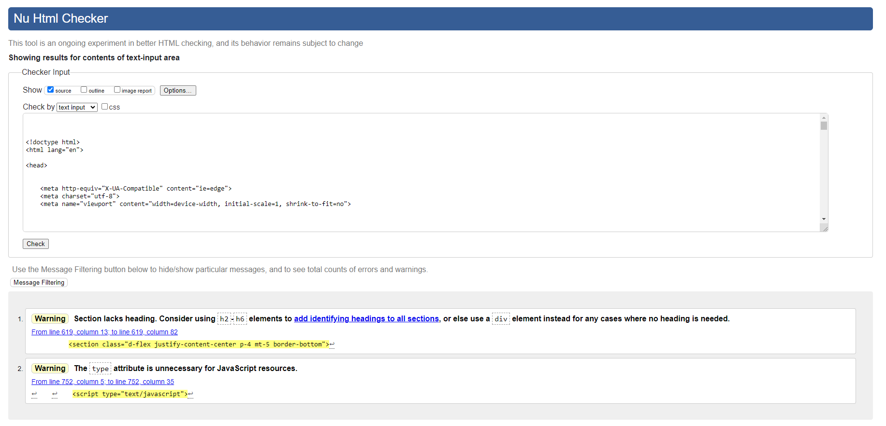

All Products page:
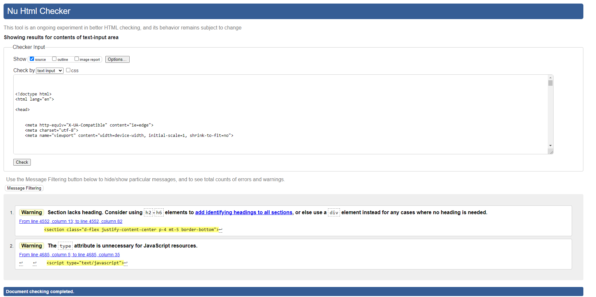

Checkout success page:
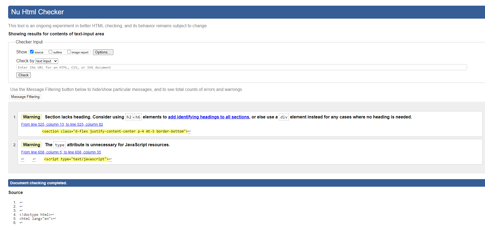

Checkout page:
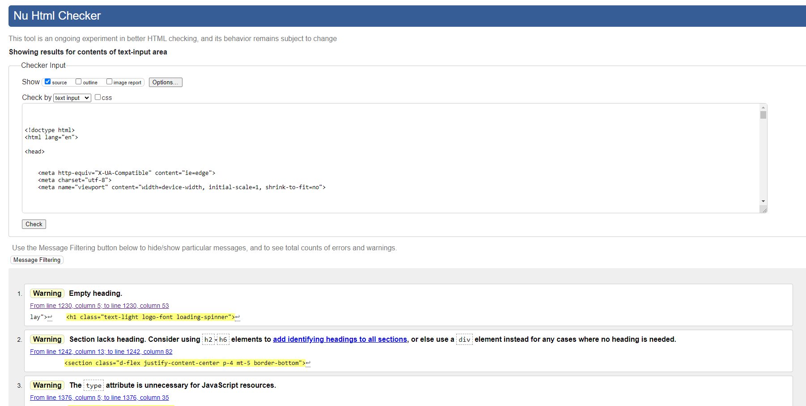

Contact us page:
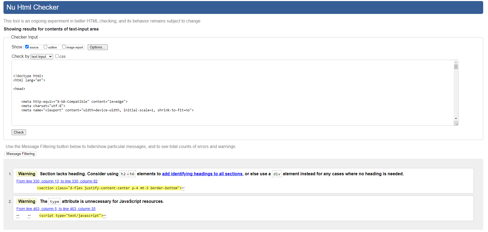

Error 404 page:
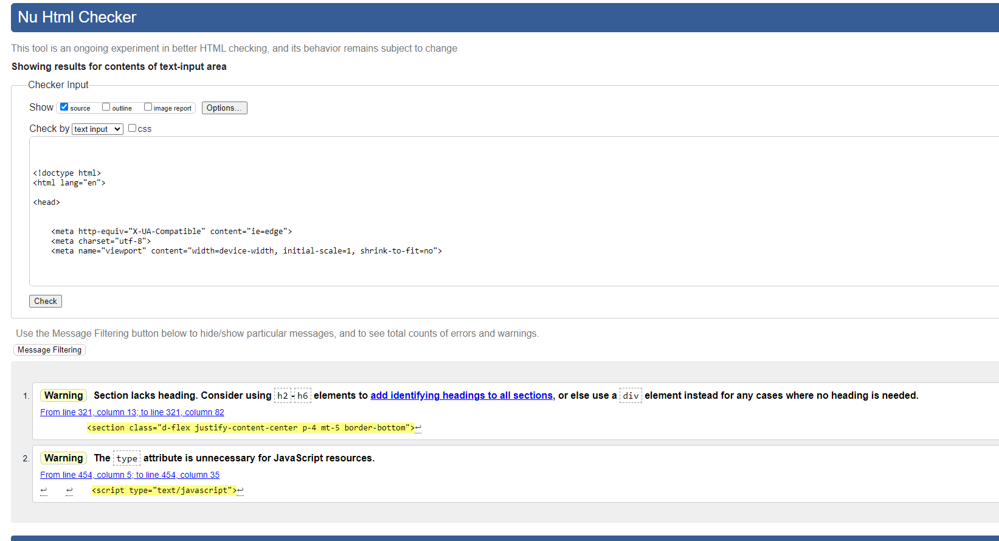

Our Guarantee page:
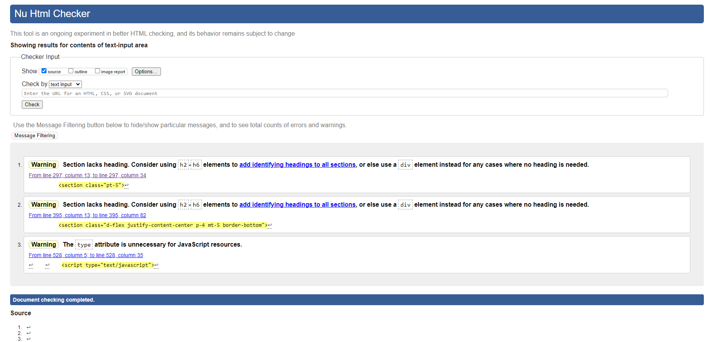

Landing page:
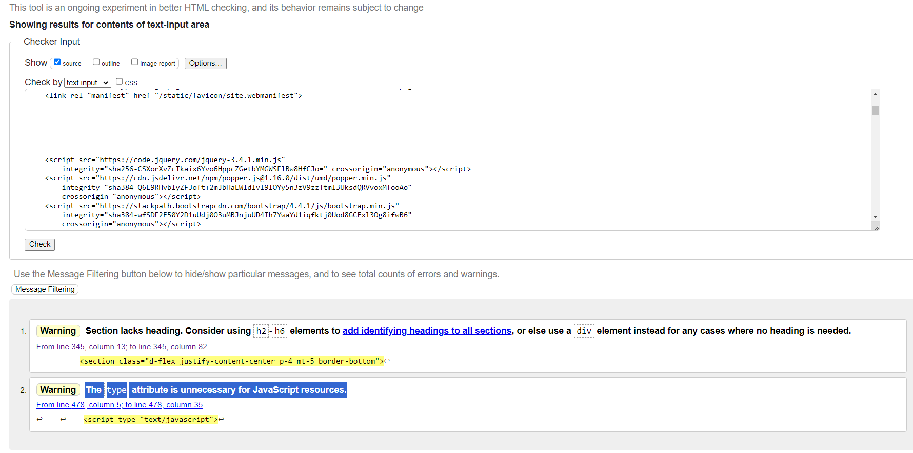

Legal page:
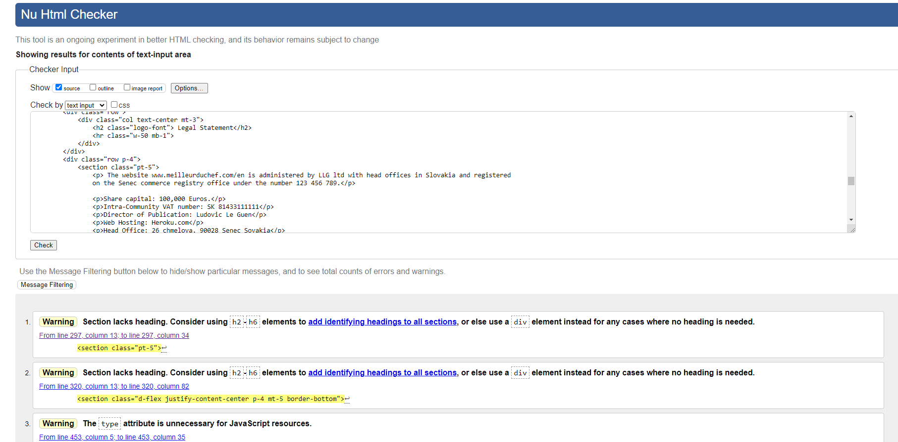

Login page:
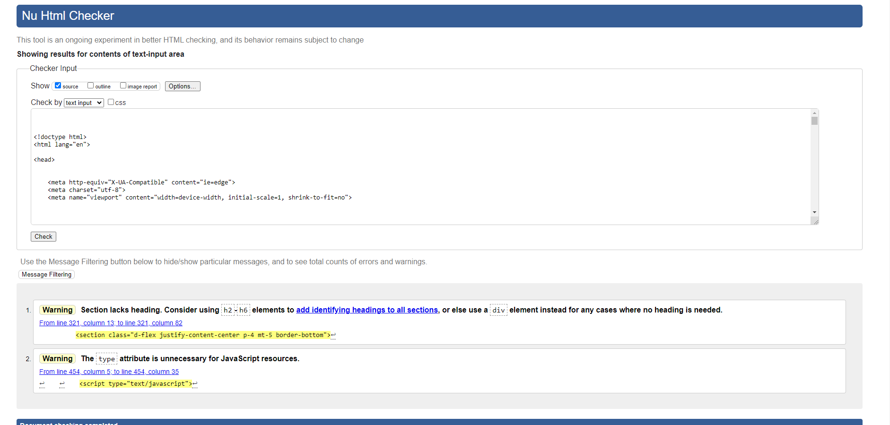

logout page:

One Brand page:
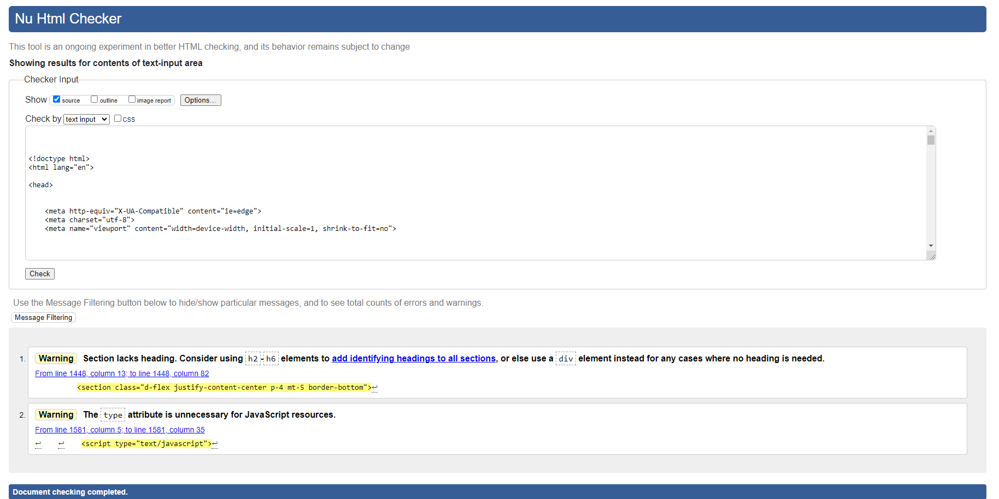

Privacy Policy page:
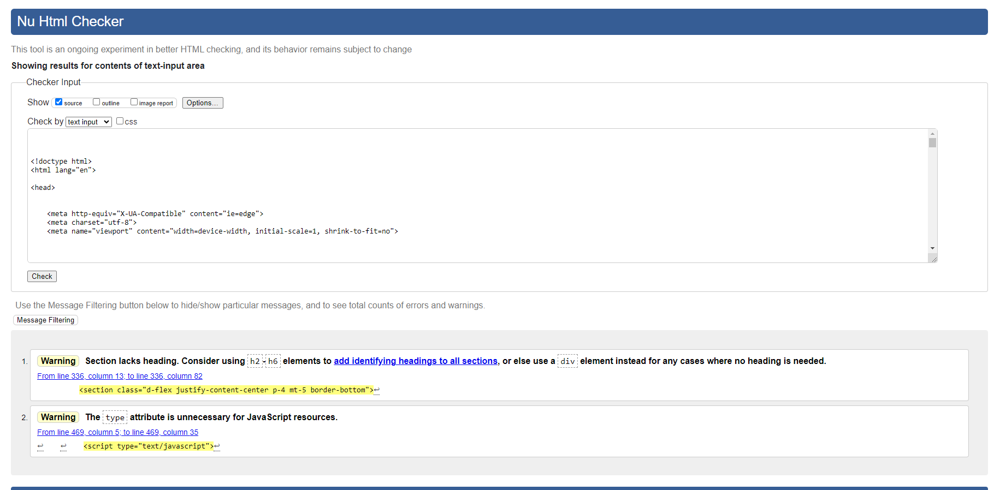

Product details page:
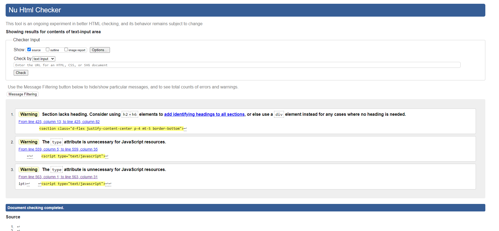

Profile page:
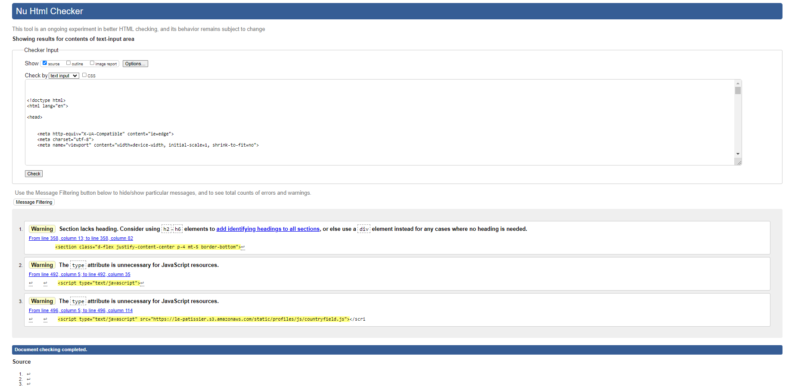

Register page:
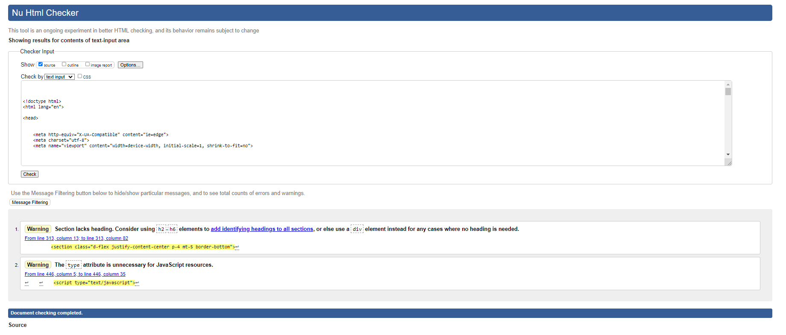

Terms Conditions page:
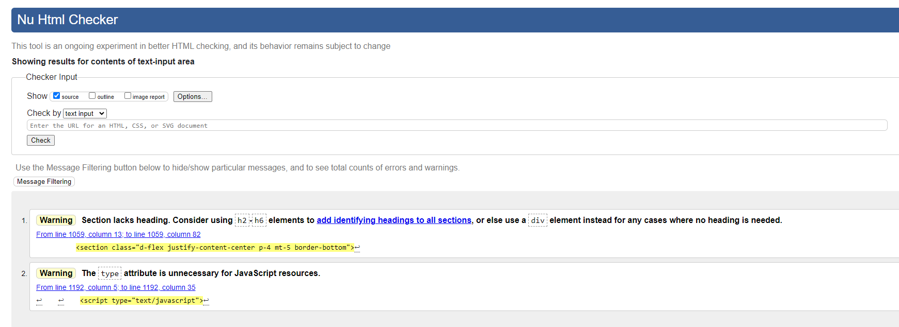

### CSS

[W3C](https://validator.w3.org/) was used to validate the CSS. 

Static CSS file:
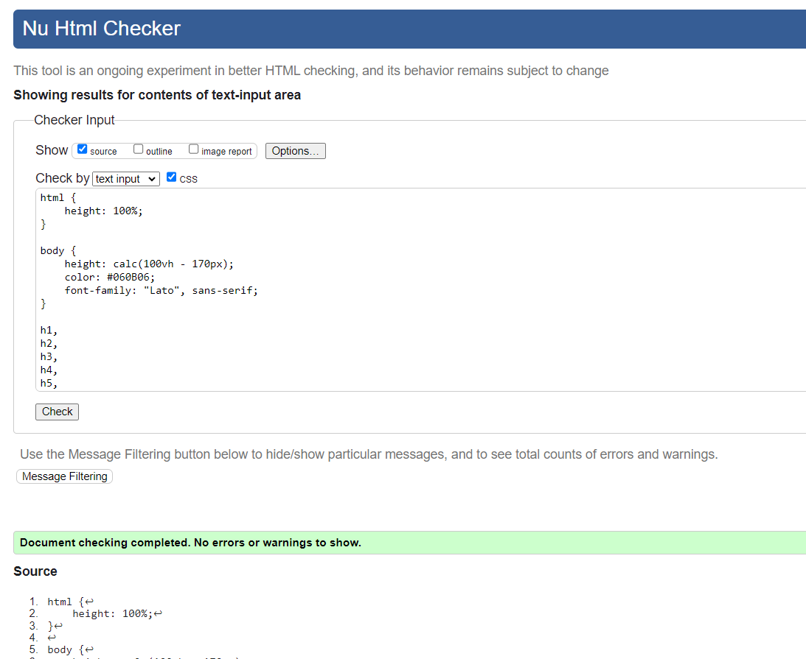

Profile CSS file:
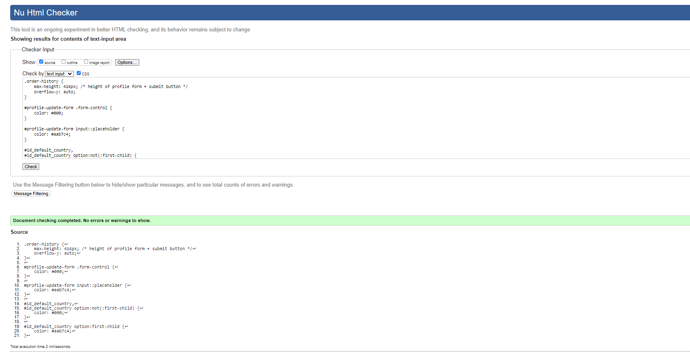

### JavaScript

[JS Hint](https://jshint.com/) was used to validate the JavaScript.

JS Stripe file:

### Python

[Code Institute Python Linter](https://pep8ci.herokuapp.com/) was used to validate the Python.

Blog admin py:

Blog models py:

Blog views py:

Cart contexts py:

Cart views py:

Checkout admin py:

Checkout forms py:

Checkout models py:

Checkout views py:

Checkout webhook handler py:

Checkout webhooks py:

Home views py:

Products admin py:

Products forms py:

Products views py:

Profiles forms py:

Profiles models py:

Profiles views py:

Reviews admin py:

Reviews models py:

Reviews views py:

Test a Wheel settings py:

Test a Wheel urls py:

## Lighthouse

For the performance, accessibility, best practices, and SEO of the site for mobile and desktop I used the Chrome Lighthouse tool:

#### Desktop Results

Index Page:

Services Page:

User Profile:

Blog Page:

Reviews Page:

Checkout Page:

- Desktop performed well on all major pages of the site.
- The 83-point score for Best Practices is due to the scripts beyond my control (e.g. Mailchimp)

#### Mobile Results

Index Page:

Services Page:

User Profile:

Blog Page:

Reviews Page:

Checkout Page:

- Mobile performed well on all major pages of the site.
- The 83-point score for Best Practices is due to the scripts beyond my control (e.g. Mailchimp)

## Manual Testing

This table shows all the manual testing done for the website, and whether it worked as expected or not.

### General

#### Navbar

Feature Tested | Expected Result | Actual Result | Pass/Fail
---------------|-----------------|---------------|----------
NavBar responsiveness | NavBar resizes according to devices | As expected | Pass

NavBar responsiveness

NavBar responsiveness

Feature Tested | Expected Result | Actual Result | Pass/Fail
---------------|-----------------|---------------|----------
NavBar categories responsiveness| Categories become burger menu | As expected | Pass

NavBar categories responsiveness

NavBar categories responsiveness

Feature Tested | Expected Result | Actual Result | Pass/Fail
---------------|-----------------|---------------|----------
NavBar categories hover opening| Categories menus open and close on hover with screens above 992px | As expected | Pass

NavBar categories hover opening

Feature Tested | Expected Result | Actual Result | Pass/Fail
---------------|-----------------|---------------|----------
Search field | Search field transforms in button with medium screens and lower | As expected | Pass

Search field

Search field

Feature Tested | Expected Result | Actual Result | Pass/Fail
---------------|-----------------|---------------|----------
Search | Inserting a term gives a list of products | As expected | Pass

Search

Feature Tested | Expected Result | Actual Result | Pass/Fail
---------------|-----------------|---------------|----------
Account icon | Account icon opens on click only | As expected | Pass

Account icon

Feature Tested | Expected Result | Actual Result | Pass/Fail
---------------|-----------------|---------------|----------
Account icon | Account icon is different for logged in admins and users | As expected | Pass

Account icon

Account icon

Feature Tested | Expected Result | Actual Result | Pass/Fail
---------------|-----------------|---------------|----------
Account icon | Account icon shows log in and register for unlogged users | As expected | Pass

Account icon

Feature Tested | Expected Result | Actual Result | Pass/Fail
---------------|-----------------|---------------|----------
Shopping basket | redirects to the shopping basket template | As expected | Pass

Shopping basket

Feature Tested | Expected Result | Actual Result | Pass/Fail
---------------|-----------------|---------------|----------
Action messages | messages appears on the top right corner consistenly | As expected | Pass

Action messages

#### Footer

Feature Tested | Expected Result | Actual Result | Pass/Fail
---------------|-----------------|---------------|----------
Footer responsiveness | Footer layout changes according to devices | As expected | Pass

Footer responsiveness

Footer responsiveness

Feature Tested | Expected Result | Actual Result | Pass/Fail
---------------|-----------------|---------------|----------
Footer links | All external links open a new tab in the browser | As expected | Pass

Footer links

Footer links

Feature Tested | Expected Result | Actual Result | Pass/Fail
---------------|-----------------|---------------|----------
Footer links | All links redirects to the correct brand | As expected | Pass
Footer brands and legal links | Links are underlined on hover | As expected | Pass

Footer brands and legal links

Feature Tested | Expected Result | Actual Result | Pass/Fail
---------------|-----------------|---------------|----------
Newsletter button | Button redirects to Newsletter registration form | As expected | Pass

Newsletter button

Feature Tested | Expected Result | Actual Result | Pass/Fail
---------------|-----------------|---------------|----------
Newsletter button hover | Button changes color on hover | As expected | Pass

Newsletter button hover

Feature Tested | Expected Result | Actual Result | Pass/Fail
---------------|-----------------|---------------|----------
Newsletter button responsiveness | Enveloppe icons dissapear on screens snmaller than 347px | As expected | Pass

Newsletter button responsiveness

Feature Tested | Expected Result | Actual Result | Pass/Fail
---------------|-----------------|---------------|----------
Contact button | Button redirects to contact us form | As expected | Pass

Contact button

 

### Landing Page

Feature Tested | Expected Result | Actual Result | Pass/Fail
---------------|-----------------|---------------|----------
Hero image resizes on mobile | Images resize on mobile | As expected | Pass

Hero image resizes on mobile

Feature Tested | Expected Result | Actual Result | Pass/Fail
---------------|-----------------|---------------|----------
Title size reduces on smaller screens | Title gets smaller | As expected | Pass

Title size reduces on smaller screens

Feature Tested | Expected Result | Actual Result | Pass/Fail
---------------|-----------------|---------------|----------
Shop now button reduces size | Buttons gets smaller on small screens | As expected | Pass

Shop now button reduces size

Feature Tested | Expected Result | Actual Result | Pass/Fail
---------------|-----------------|---------------|----------
Shop now button redirection | Button redirects to all products | As expected | Pass

Shop now button redirection

Feature Tested | Expected Result | Actual Result | Pass/Fail
---------------|-----------------|---------------|----------
Why shopping with us section responsiveness | Boxes and title rearrange harmoniously | As expected | Pass

Why shopping with us section responsiveness

 

### All products page

Feature Tested | Expected Result | Actual Result | Pass/Fail
---------------|-----------------|---------------|----------
All products | Shows all products by default | As expected | Pass

All products

Feature Tested | Expected Result | Actual Result | Pass/Fail
---------------|-----------------|---------------|----------
Product card layout | 4 cards per row on large screens | As expected | Pass

Product card layout

Feature Tested | Expected Result | Actual Result | Pass/Fail
---------------|-----------------|---------------|----------
Product card layout responsiveness| number of items per reduces with smaller screens | As expected | Pass

Product card layout responsiveness

Feature Tested | Expected Result | Actual Result | Pass/Fail
---------------|-----------------|---------------|----------
Product card image | Opens the product detail page | As expected | Pass
Product card image| default no image shows when no pitcure given to product | As expected | Pass

Product card image

Feature Tested | Expected Result | Actual Result | Pass/Fail
---------------|-----------------|---------------|----------
Click on cards Brand | Shows only the products of the brand | As expected | Pass

Click on cards Brand

Feature Tested | Expected Result | Actual Result | Pass/Fail
---------------|-----------------|---------------|----------
Category Selection | shows the correct products | As expected | Pass

Category Selection

Feature Tested | Expected Result | Actual Result | Pass/Fail
---------------|-----------------|---------------|----------
Discount category shows products on sale | products with a discount are shown | As expected | Pass

Discount category shows products on sale

Feature Tested | Expected Result | Actual Result | Pass/Fail
---------------|-----------------|---------------|----------
Sorting menu | sorts products correctly | As expected | Pass

Sorting menu

Feature Tested | Expected Result | Actual Result | Pass/Fail
---------------|-----------------|---------------|----------
Items quantity in the category | Show the correct number of different products | As expected | Pass

Items quantity in the category

Feature Tested | Expected Result | Actual Result | Pass/Fail
---------------|-----------------|---------------|----------
Edit and delete buttons | Show only for logged in admins | As expected | Pass

Edit and delete buttons

 

### Product details page

Feature Tested | Expected Result | Actual Result | Pass/Fail
---------------|-----------------|---------------|----------
All products | Shows all products by default | As expected | Pass

All products

Feature Tested | Expected Result | Actual Result | Pass/Fail
---------------|-----------------|---------------|----------
Product card layout | 4 cards per row on large screens | As expected | Pass

Product card layout

Feature Tested | Expected Result | Actual Result | Pass/Fail
---------------|-----------------|---------------|----------
Edit and delete buttons | Show only for logged in admins | As expected | Pass

Edit and delete buttons

Feature Tested | Expected Result | Actual Result | Pass/Fail
---------------|-----------------|---------------|----------
Quantity selector | cannot go under 1 and cannot go above 99 | As expected | Pass

Quantity selector

Feature Tested | Expected Result | Actual Result | Pass/Fail
---------------|-----------------|---------------|----------
Adding product to basket | Add the coorect amount of the correct product in the basket | As expected | Pass

Items quantity in the category

Feature Tested | Expected Result | Actual Result | Pass/Fail
---------------|-----------------|---------------|----------
Keep shopping button | redirects to all products | As expected | Pass

Items quantity in the category

Feature Tested | Expected Result | Actual Result | Pass/Fail
---------------|-----------------|---------------|----------
Product details | Are from the correct product | As expected | Pass

Items quantity in the category

Feature Tested | Expected Result | Actual Result | Pass/Fail
---------------|-----------------|---------------|----------
Submitting a review | Success mesage is sent | As expected | Pass

Items quantity in the category

Feature Tested | Expected Result | Actual Result | Pass/Fail
---------------|-----------------|---------------|----------
Submitting a review | Does not show as long as not approved by admins | As expected | Pass

Items quantity in the category

Feature Tested | Expected Result | Actual Result | Pass/Fail
---------------|-----------------|---------------|----------
Submitting another review | Submitting review for same product updates product | As expected | Pass

Items quantity in the category

Feature Tested | Expected Result | Actual Result | Pass/Fail
---------------|-----------------|---------------|----------
No review form when user is not logged in | "Log in to post a review" appears with the button to log in| As expected | Pass

Items quantity in the category

Feature Tested | Expected Result | Actual Result | Pass/Fail
---------------|-----------------|---------------|----------
Rating a product in Review| Choosing a rating changes the overall rating | As expected | Pass

Items quantity in the category

Feature Tested | Expected Result | Actual Result | Pass/Fail
---------------|-----------------|---------------|----------
Rating a product in Review| Shows the number of reviews | As expected | Pass

Items quantity in the category

Feature Tested | Expected Result | Actual Result | Pass/Fail
---------------|-----------------|---------------|----------
No rating | Message "no rating" in product details | As expected | Pass

Items quantity in the category

 

### Contact page

Feature Tested | Expected Result | Actual Result | Pass/Fail
---------------|-----------------|---------------|----------
Contact form sent to admin panel | Message show in admin | As expected | Pass

Contact form sent to admin panel

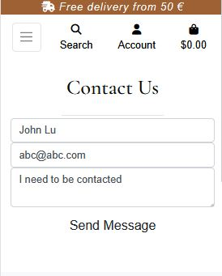

Contact form sent to admin panel

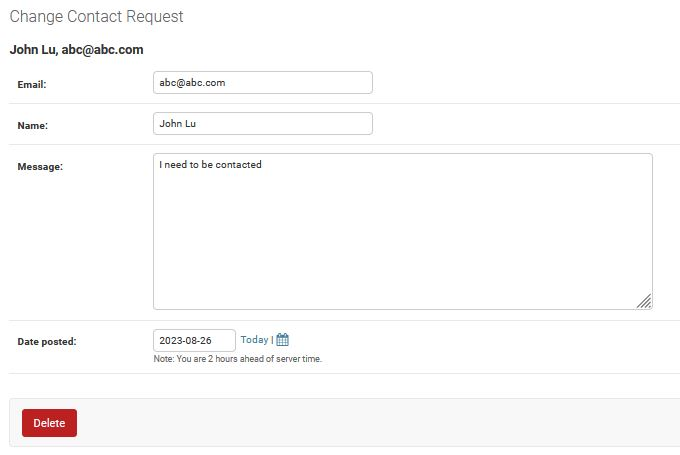

Feature Tested | Expected Result | Actual Result | Pass/Fail
---------------|-----------------|---------------|----------
User gets feedback on submission | Success or error message show | As expected | Pass

User gets feedback on submission

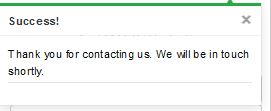

 

### Shopping Basket page

Feature Tested | Expected Result | Actual Result | Pass/Fail
---------------|-----------------|---------------|----------
One Reference per row | Each product is repreented by a row | As expected | Pass

One Reference per row

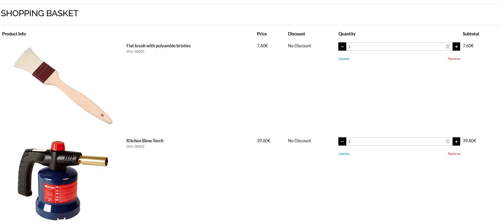

Feature Tested | Expected Result | Actual Result | Pass/Fail
---------------|-----------------|---------------|----------
Product details | Are identical to the product details page | As expected | Pass

Product details

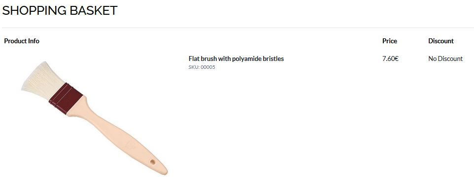

Feature Tested | Expected Result | Actual Result | Pass/Fail
---------------|-----------------|---------------|----------
Price on basket Icon and grand total | prices are identical | As expected | Pass

Price on basket Icon and grand total

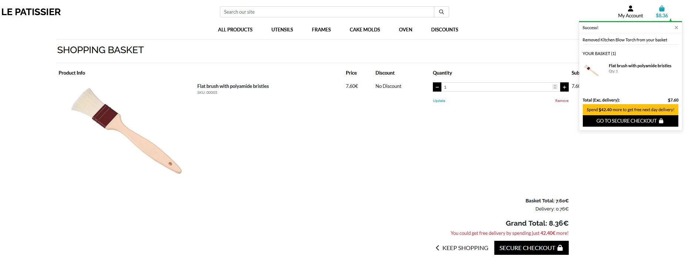

Feature Tested | Expected Result | Actual Result | Pass/Fail
---------------|-----------------|---------------|----------
Updating a quantity | Changes the price and grand total accordingly | As expected | Pass

Updating a quantity

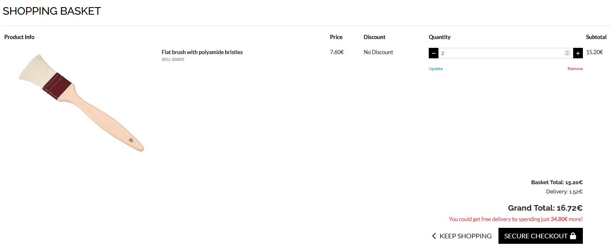

Feature Tested | Expected Result | Actual Result | Pass/Fail
---------------|-----------------|---------------|----------
Removing product | Removes product from basket | As expected | Pass

Removing product

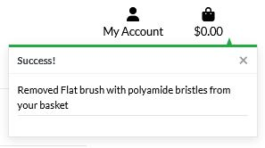

Feature Tested | Expected Result | Actual Result | Pass/Fail
---------------|-----------------|---------------|----------
Removing product | Removes product Changes price accordingly | As expected | Pass

Removing product

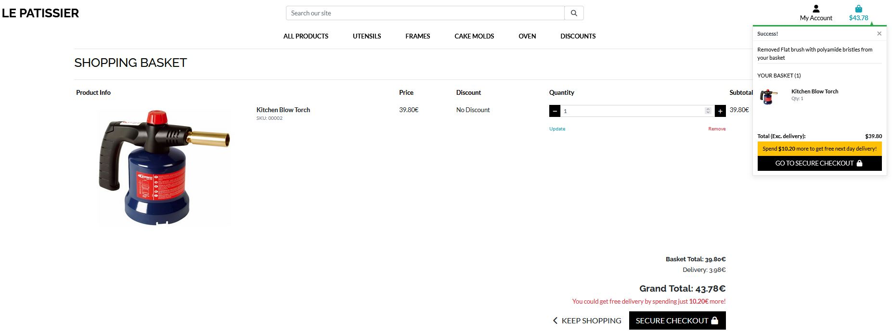

Feature Tested | Expected Result | Actual Result | Pass/Fail
---------------|-----------------|---------------|----------
Delivery treshhold | Is 10% and 0euro with purchase over 50 euros  | As expected | Pass

Delivery treshhold

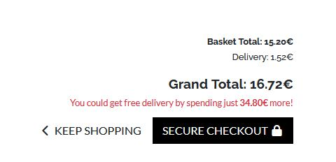

Feature Tested | Expected Result | Actual Result | Pass/Fail
---------------|-----------------|---------------|----------
Success messages | Feedback messages are given with each action | As expected | Pass

Success messages

 

### Product Management page

Feature Tested | Expected Result | Actual Result | Pass/Fail
---------------|-----------------|---------------|----------
Adding a product message | Success message when product is added | As expected | Pass

Adding a product message

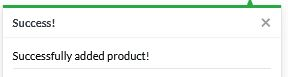

Feature Tested | Expected Result | Actual Result | Pass/Fail
---------------|-----------------|---------------|----------
Cancel button | Redirects user to all product page | As expected | Pass

Cancel button

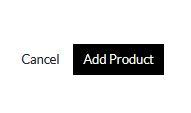

Feature Tested | Expected Result | Actual Result | Pass/Fail
---------------|-----------------|---------------|----------
Adding a product | all Form fileds are blank | As expected | Pass

Adding a product

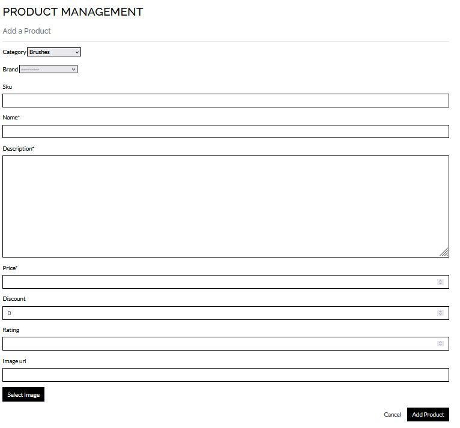

Feature Tested | Expected Result | Actual Result | Pass/Fail
---------------|-----------------|---------------|----------
Edit a product | Form is prefilled with the product info | As expected | Pass

Edit a product

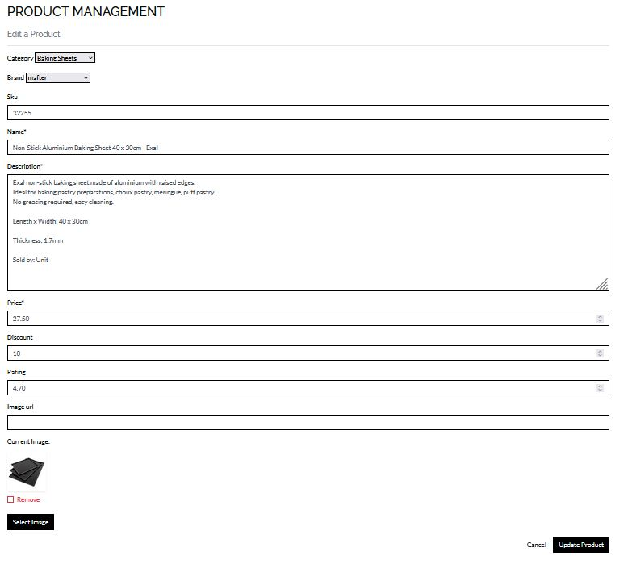

Feature Tested | Expected Result | Actual Result | Pass/Fail
---------------|-----------------|---------------|----------
Edit product image | Edit Image field contains the actual picture | As expected | Pass

Edit product image

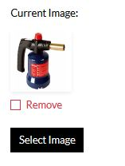

Feature Tested | Expected Result | Actual Result | Pass/Fail
---------------|-----------------|---------------|----------
Removing image | Default picture will be seen on product  | As expected | Pass

Removing image

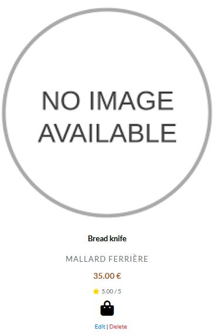

 

### My Profile page

Feature Tested | Expected Result | Actual Result | Pass/Fail
---------------|-----------------|---------------|----------
All of a users orders are deleted on profile deletion | orders removed from database | As expected | Pass
My Profile link renders Profile page | profile.html is shown | As expected | Pass

My Profile link renders Profile page

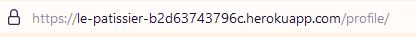

Feature Tested | Expected Result | Actual Result | Pass/Fail
---------------|-----------------|---------------|----------
User information is displayed on Profile page | Name and Address fields shown | As expected | Pass

User information is displayed on Profile page

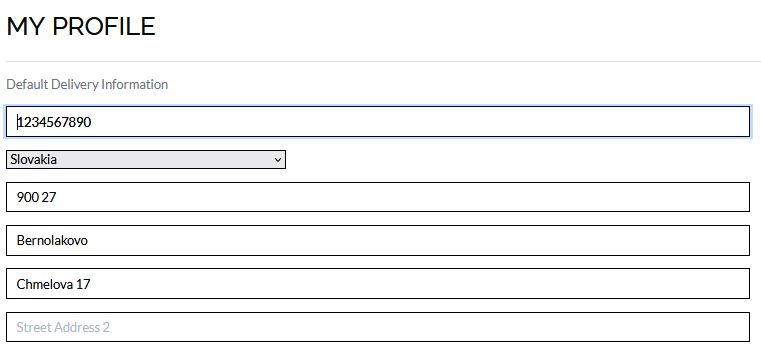

Feature Tested | Expected Result | Actual Result | Pass/Fail
---------------|-----------------|---------------|----------
Update button saves updated form | Message "Profile updated successfully" shown | As expected | Pass

Update button saves updated form

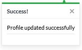

Feature Tested | Expected Result | Actual Result | Pass/Fail
---------------|-----------------|---------------|----------
User order history shown on Profile Orders tab | Orders tab shows all past orders | As expected | Pass

User order history shown on Profile Orders tab

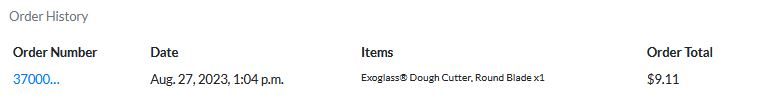

Feature Tested | Expected Result | Actual Result | Pass/Fail
---------------|-----------------|---------------|----------
Delete Account tab opens account delete message | message "Warning! Account deletion is permanent. Proceed?" shown | As expected | Pass

Delete Account tab opens account delete message

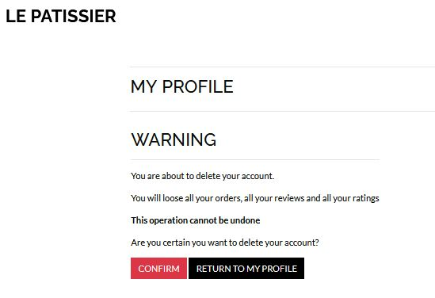

Feature Tested | Expected Result | Actual Result | Pass/Fail
---------------|-----------------|---------------|----------
Delete Account button opens account delete confirmation page | user-delete with user id in url shown | As expected | Pass

Delete Account button

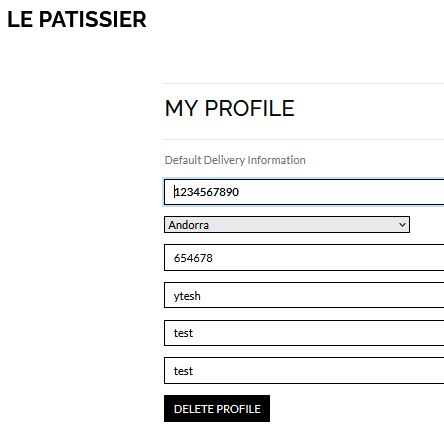

Feature Tested | Expected Result | Actual Result | Pass/Fail
---------------|-----------------|---------------|----------
Return button on user_delete page redirects back to profile | profile.html renders | As expected | Pass

Return button

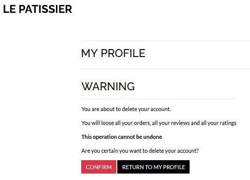

Return button

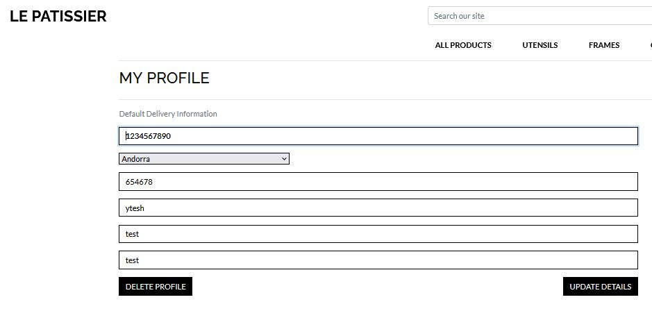

Feature Tested | Expected Result | Actual Result | Pass/Fail
---------------|-----------------|---------------|----------
Confirm button on user_delete page redirects back to index.html | index.html renders | As expected | Pass

Confirm button

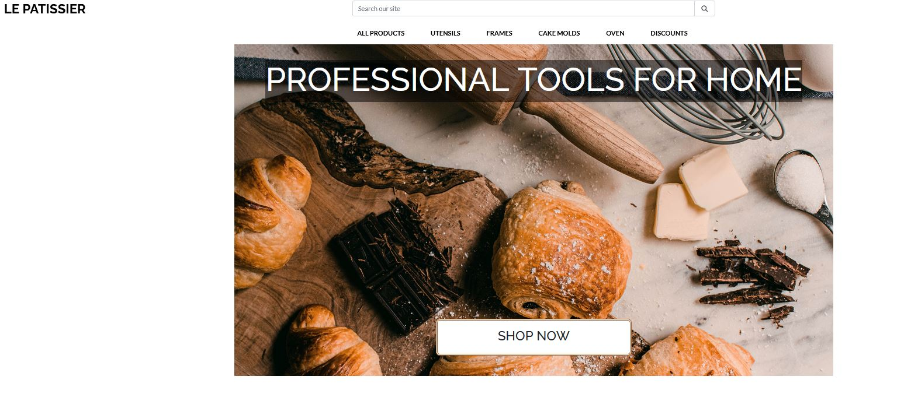

Feature Tested | Expected Result | Actual Result | Pass/Fail
---------------|-----------------|---------------|----------
Confirmation message on user_delete shows | message "Profile successfully deleted" shown | As expected | Pass

Confirmation message

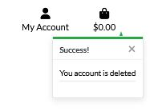

 

### Logging pages

Feature Tested | Expected Result | Actual Result | Pass/Fail
---------------|-----------------|---------------|----------
Clicking on log in | opens log in form | As expected | Pass

Clicking on log in

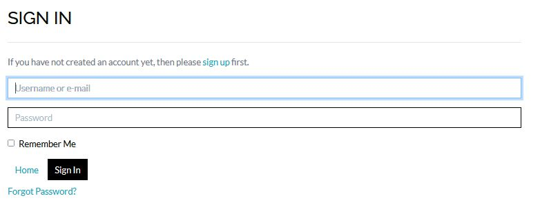

Feature Tested | Expected Result | Actual Result | Pass/Fail
---------------|-----------------|---------------|----------
Submitting log in | User is logged in | As expected | Pass

Submitting log in

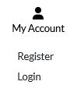

Feature Tested | Expected Result | Actual Result | Pass/Fail
---------------|-----------------|---------------|----------
Logging in message | success Message shows up| As expected | Pass

Logging in message

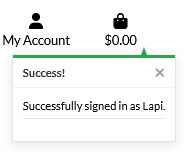

Feature Tested | Expected Result | Actual Result | Pass/Fail
---------------|-----------------|---------------|----------
Log in redirection | logged in User is redirected to home page | As expected | Pass

Log in redirection

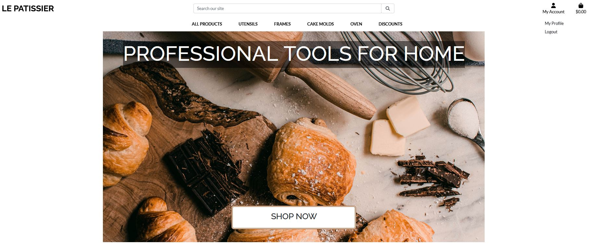

Feature Tested | Expected Result | Actual Result | Pass/Fail
---------------|-----------------|---------------|----------
Clicking on log out | opens log out form | As expected | Pass

Clicking on log out

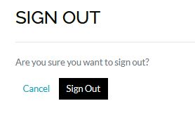

Feature Tested | Expected Result | Actual Result | Pass/Fail
---------------|-----------------|---------------|----------
Submitting log out | User is logged out | As expected | Pass

Submitting log out

Feature Tested | Expected Result | Actual Result | Pass/Fail
---------------|-----------------|---------------|----------
Logging out message | success Message shows up| As expected | Pass

Logging out message

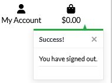

Feature Tested | Expected Result | Actual Result | Pass/Fail
---------------|-----------------|---------------|----------
Log out redirection | logged out User is redirected to home page | As expected | Pass

Log out redirection

 

### Subscribing pages

Feature Tested | Expected Result | Actual Result | Pass/Fail
---------------|-----------------|---------------|----------
Completing submission | Redirects to subscribe success page | As expected | Pass
Completing unsubscribe form | Redirects to unsubscribe success page | As expected | Pass
Not inserting email | Error message | As expected | Pass

Not inserting email

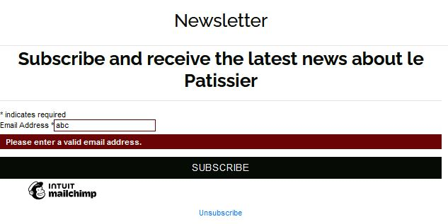

 

### Stripe Payment

Feature Tested | Expected Result | Actual Result | Pass/Fail
---------------|-----------------|---------------|----------
Payment being processed | Icon and overlay appears when payment is being processed | As expected | Pass

Payment being processed

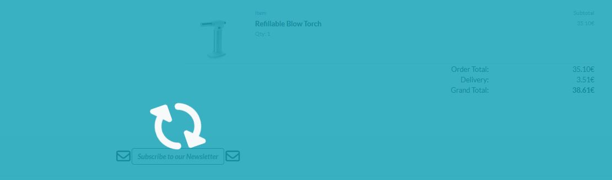

Feature Tested | Expected Result | Actual Result | Pass/Fail
---------------|-----------------|---------------|----------
Confirmation page | order number created | As expected | Pass

Confirmation page

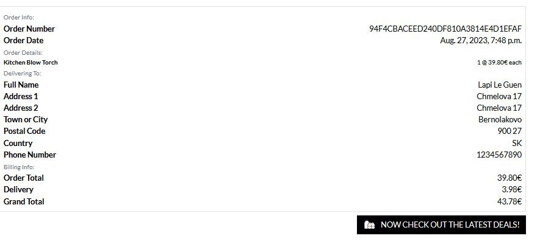

Feature Tested | Expected Result | Actual Result | Pass/Fail
---------------|-----------------|---------------|----------
Confirmation page | email sent to correct email | As expected | Pass

onfirmation page

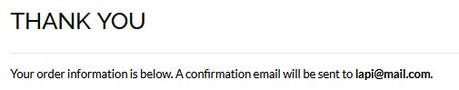

Feature Tested | Expected Result | Actual Result | Pass/Fail
---------------|-----------------|---------------|----------

 

### Checkout page

Feature Tested | Expected Result | Actual Result | Pass/Fail
---------------|-----------------|---------------|----------
Adding product shows feedback message | Message shows in top right corner | As expected | Pass

Adding product shows feedback message

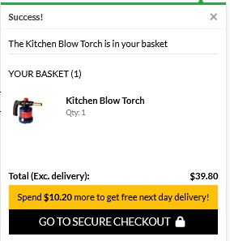

Feature Tested | Expected Result | Actual Result | Pass/Fail
---------------|-----------------|---------------|----------
Product details shown in Basket | Products are arranged in a table | As expected | Pass

Product details shown in Basket

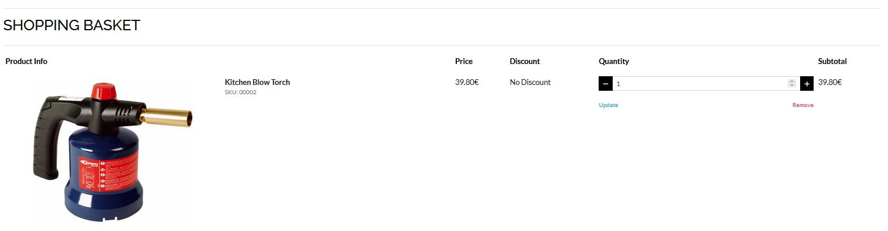

Feature Tested | Expected Result | Actual Result | Pass/Fail
---------------|-----------------|---------------|----------
Discount price of product shown in basket | Products show dicount price | As expected | Pass

Discount price of product shown in basket

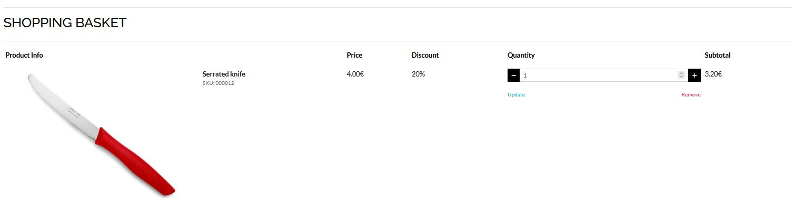

Feature Tested | Expected Result | Actual Result | Pass/Fail
---------------|-----------------|---------------|----------
Update quantity button updates subtotal | Subtotal calculated correctly | As expected | Pass

Update quantity button updates subtotal

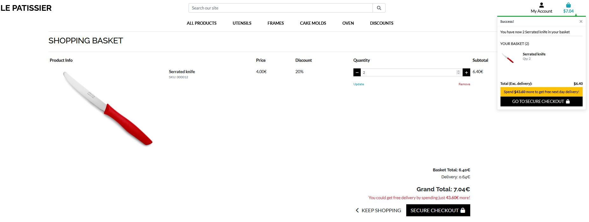

Feature Tested | Expected Result | Actual Result | Pass/Fail
---------------|-----------------|---------------|----------
Delete product button removes product | Product is removed from Basket| As expected | Pass

Delete product button removes product

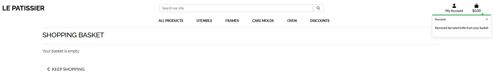

Feature Tested | Expected Result | Actual Result | Pass/Fail
---------------|-----------------|---------------|----------
Secure Checkout button opens checkout page | checkout.html renders | As expected | Pass

Secure Checkout button opens checkout page

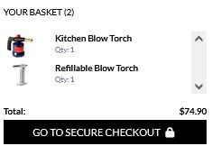

Feature Tested | Expected Result | Actual Result | Pass/Fail
---------------|-----------------|---------------|----------
User details prepoulated when saved | Fields are filled with info| As expected | Pass

User details prepoulated when saved

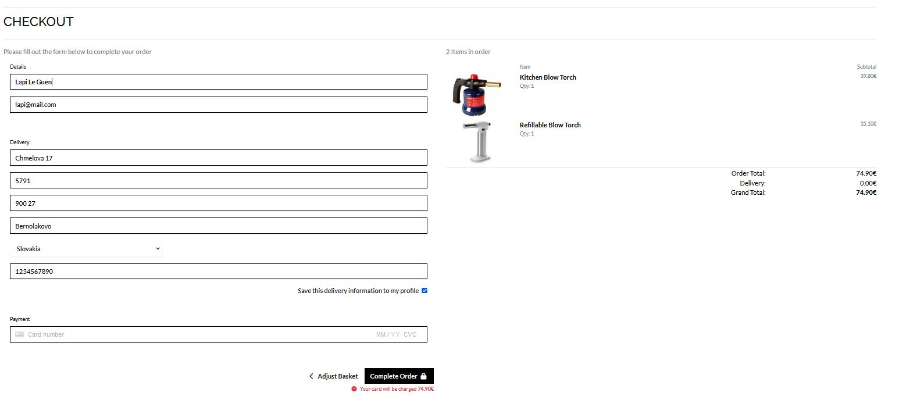

 

