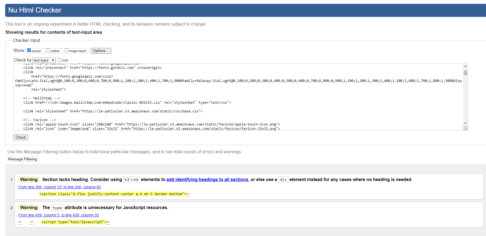
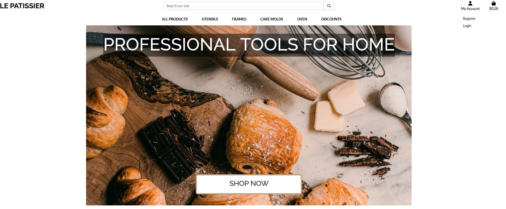

# Le Patissier - Testing Documentation

Below is the documentation of my testing process.

## Table of contents
- [Le Patissier - Testing Documentation](#le-patissier---testing-documentation)
  * [Table of contents](#table-of-contents)
  * [Validation Testing](#validation-testing)
    + [CSS](#css)
    + [JavaScript](#javascript)
    + [Python](#python)
  * [Lighthouse](#lighthouse)
      - [Desktop Results](#desktop-results)
  * [Manual Testing](#manual-testing)
    + [Testing User Stories](#testing-user-stories)

## Validation Testing

[W3C](https://validator.w3.org/) was used to validate all pages HTML and CSS of Le Patissier site. 

All Brands Page:

All Products page:

Checkout success page:

Checkout page:

Contact us page:

Error 404 page:

Our Guarantee page:

Landing page:

Legal page:

Login page:

logout page:

One Brand page:

Privacy Policy page:

Product details page:

Profile page:

Register page:

Terms Conditions page:

### CSS

[W3C](https://validator.w3.org/) was used to validate the CSS. 

Static CSS file:

Profile CSS file:

### JavaScript

[JS Hint](https://jshint.com/) was used to validate the JavaScript.

JS Stripe:

### Python

[Code Institute Python Linter](https://pep8ci.herokuapp.com/) was used to validate the Python.

Basket context py:

Basket urls py:

Basket views py:

Checkout admin py:

Checkout forms py:

Checkout models py:

Checkout signals py:

Checkout urls py:

Checkout views py:

Checkout webhook handler py:

Checkout webhooks py:

Home admin py:

Home forms py:

Home models py:

Home urls py:

Home views py:

Marketing forms py:

Marketing urls py:

Marketing views py:

Products admin py:

Products models py:

Products forms py:

Products urls py:

Products views py:

Profiles forms py:

Profiles models py:

Profiles urls py:

Profiles views py:

### Lighthouse

#### Desktop Results

All products Page:

Basket Page:

Checkout Page:

Landing Page:

Newsletter Page:

Product details Page:

Profile Page:

## Manual Testing

This table shows all the manual testing done for the website, and whether it worked as expected or not.

### General

#### Navbar

Feature Tested | Expected Result | Actual Result | Pass/Fail
---------------|-----------------|---------------|----------
NavBar responsiveness | NavBar resizes according to devices | As expected | Pass

1[NavBar responsiveness](documentation/testings/images/navbar/navbar-responsiveness-1.JPG)

---
---

Feature Tested | Expected Result | Actual Result | Pass/Fail
---------------|-----------------|---------------|----------
NavBar categories responsiveness| Categories become burger menu | As expected | Pass

---
---

Feature Tested | Expected Result | Actual Result | Pass/Fail
---------------|-----------------|---------------|----------
NavBar categories hover opening| Categories menus open and close on hover with screens above 992px | As expected | Pass

NavBar categories hover opening

---
---

Feature Tested | Expected Result | Actual Result | Pass/Fail
---------------|-----------------|---------------|----------
Search | Inserting a term gives a list of products | As expected | Pass
Search field | Search field transforms in button with medium screens and lower | As expected | Pass

---
----

Feature Tested | Expected Result | Actual Result | Pass/Fail
---------------|-----------------|---------------|----------
Account icon | Account icon opens on click only | As expected | Pass

---
---

Feature Tested | Expected Result | Actual Result | Pass/Fail
---------------|-----------------|---------------|----------
Account icon | Account icon is different for logged in admins and users | As expected | Pass

---
---

Feature Tested | Expected Result | Actual Result | Pass/Fail
---------------|-----------------|---------------|----------
Account icon | Account icon shows log in and register for unlogged users | As expected | Pass

---
---

Feature Tested | Expected Result | Actual Result | Pass/Fail
---------------|-----------------|---------------|----------
Shopping basket | redirects to the shopping basket template | As expected | Pass

---
---

Feature Tested | Expected Result | Actual Result | Pass/Fail
---------------|-----------------|---------------|----------
Action messages | messages appears on the top right corner consistenly | As expected | Pass

---
---

#### Footer

Feature Tested | Expected Result | Actual Result | Pass/Fail
---------------|-----------------|---------------|----------
Footer responsiveness | Footer layout changes according to devices | As expected | Pass

---
---

Feature Tested | Expected Result | Actual Result | Pass/Fail
---------------|-----------------|---------------|----------
Footer links | All external links open a new tab in the browser | As expected | Pass

---
---

Feature Tested | Expected Result | Actual Result | Pass/Fail
---------------|-----------------|---------------|----------
Footer links | All links redirects to the correct brand | As expected | Pass
Footer brands and legal links | Links are underlined on hover | As expected | Pass

---
---

Feature Tested | Expected Result | Actual Result | Pass/Fail
---------------|-----------------|---------------|----------
Newsletter button | Button redirects to Newsletter registration form | As expected | Pass

------
---

Feature Tested | Expected Result | Actual Result | Pass/Fail
---------------|-----------------|---------------|----------
Newsletter button hover | Button changes color on hover | As expected | Pass

---
---

Feature Tested | Expected Result | Actual Result | Pass/Fail
---------------|-----------------|---------------|----------
Newsletter button responsiveness | Enveloppe icons dissapear on screens snmaller than 347px | As expected | Pass

---
---

Feature Tested | Expected Result | Actual Result | Pass/Fail
---------------|-----------------|---------------|----------
Contact button | Button redirects to contact us form | As expected | Pass

 

### Landing Page

Feature Tested | Expected Result | Actual Result | Pass/Fail
---------------|-----------------|---------------|----------
Hero image resizes on mobile | Images resize on mobile | As expected | Pass

---
---

Feature Tested | Expected Result | Actual Result | Pass/Fail
---------------|-----------------|---------------|----------
Title size reduces on smaller screens | Title gets smaller | As expected | Pass

---
---

Feature Tested | Expected Result | Actual Result | Pass/Fail
---------------|-----------------|---------------|----------
Shop now button reduces size | Buttons gets smaller on small screens | As expected | Pass

---
---

Feature Tested | Expected Result | Actual Result | Pass/Fail
---------------|-----------------|---------------|----------
Shop now button redirection | Button redirects to all products | As expected | Pass

---
---

Feature Tested | Expected Result | Actual Result | Pass/Fail
---------------|-----------------|---------------|----------
Why shopping with us section responsiveness | Boxes and title rearrange harmoniously | As expected | Pass

 

### All products page

Feature Tested | Expected Result | Actual Result | Pass/Fail
---------------|-----------------|---------------|----------
All products | Shows all products by default | As expected | Pass

---
---

Feature Tested | Expected Result | Actual Result | Pass/Fail
---------------|-----------------|---------------|----------
Product card layout | 4 cards per row on large screens | As expected | Pass

---
---

Feature Tested | Expected Result | Actual Result | Pass/Fail
---------------|-----------------|---------------|----------
Product card layout responsiveness| number of items per reduces with smaller screens | As expected | Pass

---
---

Feature Tested | Expected Result | Actual Result | Pass/Fail
---------------|-----------------|---------------|----------
Product card image | Opens the product detail page | As expected | Pass
Product card image| default no image shows when no pitcure given to product | As expected | Pass

---
---

Feature Tested | Expected Result | Actual Result | Pass/Fail
---------------|-----------------|---------------|----------
Click on cards Brand | Shows only the products of the brand | As expected | Pass

---
---

Feature Tested | Expected Result | Actual Result | Pass/Fail
---------------|-----------------|---------------|----------
Category Selection | shows the correct products | As expected | Pass

---
---

Feature Tested | Expected Result | Actual Result | Pass/Fail
---------------|-----------------|---------------|----------
Discount category shows products on sale | products with a discount are shown | As expected | Pass

---
---

Feature Tested | Expected Result | Actual Result | Pass/Fail
---------------|-----------------|---------------|----------
Sorting menu | sorts products correctly | As expected | Pass

---
---

Feature Tested | Expected Result | Actual Result | Pass/Fail
---------------|-----------------|---------------|----------
Items quantity in the category | Show the correct number of different products | As expected | Pass

---
---

Feature Tested | Expected Result | Actual Result | Pass/Fail
---------------|-----------------|---------------|----------
Edit and delete buttons | Show only for logged in admins | As expected | Pass

 

### Product details page

Feature Tested | Expected Result | Actual Result | Pass/Fail
---------------|-----------------|---------------|----------
All products | Shows all products by default | As expected | Pass

---
---

Feature Tested | Expected Result | Actual Result | Pass/Fail
---------------|-----------------|---------------|----------
Product card layout | 4 cards per row on large screens | As expected | Pass

---
---

Feature Tested | Expected Result | Actual Result | Pass/Fail
---------------|-----------------|---------------|----------
Edit and delete buttons | Show only for logged in admins | As expected | Pass

---
---

Feature Tested | Expected Result | Actual Result | Pass/Fail
---------------|-----------------|---------------|----------
Quantity selector | cannot go under 1 and cannot go above 99 | As expected | Pass

---
---

Feature Tested | Expected Result | Actual Result | Pass/Fail
---------------|-----------------|---------------|----------
Adding product to basket | Add the coorect amount of the correct product in the basket | As expected | Pass

---
---

Feature Tested | Expected Result | Actual Result | Pass/Fail
---------------|-----------------|---------------|----------
Keep shopping button | redirects to all products | As expected | Pass

Feature Tested | Expected Result | Actual Result | Pass/Fail
---------------|-----------------|---------------|----------
Product details | Are from the correct product | As expected | Pass

---
---

Feature Tested | Expected Result | Actual Result | Pass/Fail
---------------|-----------------|---------------|----------
Submitting a review | Success mesage is sent | As expected | Pass

---
---

Feature Tested | Expected Result | Actual Result | Pass/Fail
---------------|-----------------|---------------|----------
Submitting a review | Does not show as long as not approved by admins | As expected | Pass

---
---

Feature Tested | Expected Result | Actual Result | Pass/Fail
---------------|-----------------|---------------|----------
Submitting another review | Submitting review for same product updates product | As expected | Pass

---
---

Feature Tested | Expected Result | Actual Result | Pass/Fail
---------------|-----------------|---------------|----------
No review form when user is not logged in | "Log in to post a review" appears with the button to log in| As expected | Pass

---
---

Feature Tested | Expected Result | Actual Result | Pass/Fail
---------------|-----------------|---------------|----------
Rating a product in Review| Choosing a rating changes the overall rating | As expected | Pass

---
---

Feature Tested | Expected Result | Actual Result | Pass/Fail
---------------|-----------------|---------------|----------
Rating a product in Review| Shows the number of reviews | As expected | Pass

---
---

Feature Tested | Expected Result | Actual Result | Pass/Fail
---------------|-----------------|---------------|----------
No rating | Message "no rating" in product details | As expected | Pass

 

### Contact page

Feature Tested | Expected Result | Actual Result | Pass/Fail
---------------|-----------------|---------------|----------
Contact form sent to admin panel | Message show in admin | As expected | Pass

---
---

Feature Tested | Expected Result | Actual Result | Pass/Fail
---------------|-----------------|---------------|----------
User gets feedback on submission | Success or error message show | As expected | Pass

 

### Shopping Basket page

Feature Tested | Expected Result | Actual Result | Pass/Fail
---------------|-----------------|---------------|----------
One Reference per row | Each product is repreented by a row | As expected | Pass

---
---

Feature Tested | Expected Result | Actual Result | Pass/Fail
---------------|-----------------|---------------|----------
Product details | Are identical to the product details page | As expected | Pass

---
---

Feature Tested | Expected Result | Actual Result | Pass/Fail
---------------|-----------------|---------------|----------
Price on basket Icon and grand total | prices are identical | As expected | Pass

---
---

Feature Tested | Expected Result | Actual Result | Pass/Fail
---------------|-----------------|---------------|----------
Updating a quantity | Changes the price and grand total accordingly | As expected | Pass

---
---

Feature Tested | Expected Result | Actual Result | Pass/Fail
---------------|-----------------|---------------|----------
Removing product | Removes product from basket | As expected | Pass

---
---

Feature Tested | Expected Result | Actual Result | Pass/Fail
---------------|-----------------|---------------|----------
Removing product | Removes product Changes price accordingly | As expected | Pass

---
---

Feature Tested | Expected Result | Actual Result | Pass/Fail
---------------|-----------------|---------------|----------
Delivery treshhold | Is 10% and 0euro with purchase over 50 euros  | As expected | Pass

---
---

Feature Tested | Expected Result | Actual Result | Pass/Fail
---------------|-----------------|---------------|----------
Success messages | Feedback messages are given with each action | As expected | Pass

 

### Product Management page

Feature Tested | Expected Result | Actual Result | Pass/Fail
---------------|-----------------|---------------|----------
Adding a product message | Success message when product is added | As expected | Pass

---
---

Feature Tested | Expected Result | Actual Result | Pass/Fail
---------------|-----------------|---------------|----------
Cancel button | Redirects user to all product page | As expected | Pass

---
---

Feature Tested | Expected Result | Actual Result | Pass/Fail
---------------|-----------------|---------------|----------
Adding a product | all Form fileds are blank | As expected | Pass

---
---

Feature Tested | Expected Result | Actual Result | Pass/Fail
---------------|-----------------|---------------|----------
Edit a product | Form is prefilled with the product info | As expected | Pass

---
---

Feature Tested | Expected Result | Actual Result | Pass/Fail
---------------|-----------------|---------------|----------
Edit product image | Edit Image field contains the actual picture | As expected | Pass

---
---

Feature Tested | Expected Result | Actual Result | Pass/Fail
---------------|-----------------|---------------|----------
Removing image | Default picture will be seen on product  | As expected | Pass

 

### My Profile page

Feature Tested | Expected Result | Actual Result | Pass/Fail
---------------|-----------------|---------------|----------
All of a users orders are deleted on profile deletion | orders removed from database | As expected | Pass
My Profile link renders Profile page | profile.html is shown | As expected | Pass

---
---

Feature Tested | Expected Result | Actual Result | Pass/Fail
---------------|-----------------|---------------|----------
User information is displayed on Profile page | Name and Address fields shown | As expected | Pass

---
---

Feature Tested | Expected Result | Actual Result | Pass/Fail
---------------|-----------------|---------------|----------
Update button saves updated form | Message "Profile updated successfully" shown | As expected | Pass

---
---

Feature Tested | Expected Result | Actual Result | Pass/Fail
---------------|-----------------|---------------|----------
User order history shown on Profile Orders tab | Orders tab shows all past orders | As expected | Pass

---
---

Feature Tested | Expected Result | Actual Result | Pass/Fail
---------------|-----------------|---------------|----------
Delete Account tab opens account delete message | message "Warning! Account deletion is permanent. Proceed?" shown | As expected | Pass

---
---

Feature Tested | Expected Result | Actual Result | Pass/Fail
---------------|-----------------|---------------|----------
Delete Account button opens account delete confirmation page | user-delete with user id in url shown | As expected | Pass

---
---

Feature Tested | Expected Result | Actual Result | Pass/Fail
---------------|-----------------|---------------|----------
Return button on user_delete page redirects back to profile | profile.html renders | As expected | Pass

---
---

Feature Tested | Expected Result | Actual Result | Pass/Fail
---------------|-----------------|---------------|----------
Confirm button on user_delete page redirects back to index.html | index.html renders | As expected | Pass

---
---

Feature Tested | Expected Result | Actual Result | Pass/Fail
---------------|-----------------|---------------|----------
Confirmation message on user_delete shows | message "Profile successfully deleted" shown | As expected | Pass

 

### Logging pages

Feature Tested | Expected Result | Actual Result | Pass/Fail
---------------|-----------------|---------------|----------
Clicking on log in | opens log in form | As expected | Pass

---
---

Feature Tested | Expected Result | Actual Result | Pass/Fail
---------------|-----------------|---------------|----------
Submitting log in | User is logged in | As expected | Pass

---
---

Feature Tested | Expected Result | Actual Result | Pass/Fail
---------------|-----------------|---------------|----------
Logging in message | success Message shows up| As expected | Pass

---
---

Feature Tested | Expected Result | Actual Result | Pass/Fail
---------------|-----------------|---------------|----------
Log in redirection | logged in User is redirected to home page | As expected | Pass

---
---

Feature Tested | Expected Result | Actual Result | Pass/Fail
---------------|-----------------|---------------|----------
Clicking on log out | opens log out form | As expected | Pass

---
---

Feature Tested | Expected Result | Actual Result | Pass/Fail
---------------|-----------------|---------------|----------
Submitting log out | User is logged out | As expected | Pass

---
---

Feature Tested | Expected Result | Actual Result | Pass/Fail
---------------|-----------------|---------------|----------
Logging out message | success Message shows up| As expected | Pass

---
---

Feature Tested | Expected Result | Actual Result | Pass/Fail
---------------|-----------------|---------------|----------
Log out redirection | logged out User is redirected to home page | As expected | Pass

 

### Subscribing pages

Feature Tested | Expected Result | Actual Result | Pass/Fail
---------------|-----------------|---------------|----------
Completing submission | Redirects to subscribe success page | As expected | Pass
Completing unsubscribe form | Redirects to unsubscribe success page | As expected | Pass
Not inserting email | Error message | As expected | Pass

 

### Stripe Payment

Feature Tested | Expected Result | Actual Result | Pass/Fail
---------------|-----------------|---------------|----------
Payment being processed | Icon and overlay appears when payment is being processed | As expected | Pass

---
---

Feature Tested | Expected Result | Actual Result | Pass/Fail
---------------|-----------------|---------------|----------
Confirmation page | order number created | As expected | Pass

---
---

Feature Tested | Expected Result | Actual Result | Pass/Fail
---------------|-----------------|---------------|----------
Confirmation page | email sent to correct email | As expected | Pass

 

### Checkout page

Feature Tested | Expected Result | Actual Result | Pass/Fail
---------------|-----------------|---------------|----------
Adding product shows feedback message | Message shows in top right corner | As expected | Pass

---
---

Feature Tested | Expected Result | Actual Result | Pass/Fail
---------------|-----------------|---------------|----------
Product details shown in Basket | Products are arranged in a table | As expected | Pass

---
---

Feature Tested | Expected Result | Actual Result | Pass/Fail
---------------|-----------------|---------------|----------
Discount price of product shown in basket | Products show dicount price | As expected | Pass

---
---

Feature Tested | Expected Result | Actual Result | Pass/Fail
---------------|-----------------|---------------|----------
Update quantity button updates subtotal | Subtotal calculated correctly | As expected | Pass

---
---

Feature Tested | Expected Result | Actual Result | Pass/Fail
---------------|-----------------|---------------|----------
Delete product button removes product | Product is removed from Basket| As expected | Pass

---
---

Feature Tested | Expected Result | Actual Result | Pass/Fail
---------------|-----------------|---------------|----------
Secure Checkout button opens checkout page | checkout.html renders | As expected | Pass

---
---

Feature Tested | Expected Result | Actual Result | Pass/Fail
---------------|-----------------|---------------|----------
User details prepoulated when saved | Fields are filled with info| As expected | Pass

 

